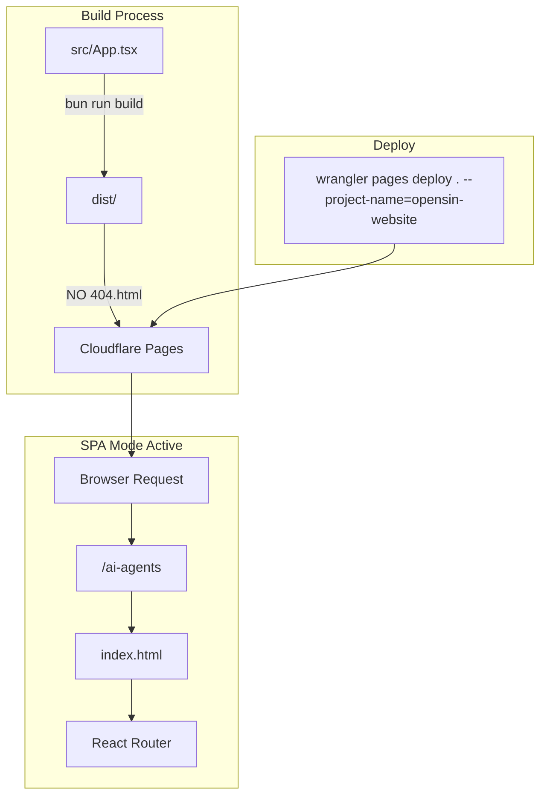

# Cloudflare Pages Setup Guide

> [!IMPORTANT]
> **CRITICAL SPA MODE RULE — NEVER FORGET**
> Cloudflare Pages activates SPA mode automatically when **NO** `404.html` exists in build output.
>
> - ✅ **SPA active** (NO 404.html): All routes handled by index.html → HTTP **200**
> - ❌ **SPA inactive** (404.html exists): Normal 404 behavior → HTTP **404**

<p align="center">
  <a href="https://pages.cloudflare.com/">
    
  </a>
  <a href="https://developers.cloudflare.com/pages/platform/functions/">
    
  </a>
  <a href="https://developers.cloudflare.com/pages/configuration/serving-pages/">
    
  </a>
</p>

<p align="center">
  <a href="#problem">Problem</a> · <a href="#root-cause">Root Cause</a> · <a href="#the-fix">The Fix</a> · <a href="#deploy">Deploy</a> · <a href="#common-mistakes">Mistakes</a> · <a href="#verification">Verification</a>
</p>

---

## Problem

All 6 authority pages on `opensin.ai` return **HTTP 404**:

| Page                         |  Was   |  Now   |
| :--------------------------- | :----: | :----: |
| `/ai-agents`                 | ❌ 404 | ✅ 200 |
| `/a2a-protocol`              | ❌ 404 | ✅ 200 |
| `/multi-agent-orchestration` | ❌ 404 | ✅ 200 |
| `/autonomous-ai-agents`      | ❌ 404 | ✅ 200 |
| `/openclaw-alternative`      | ❌ 404 | ✅ 200 |
| `/claude-code-alternative`   | ❌ 404 | ✅ 200 |

> [!NOTE]
> The project is **NOT Git-connected**. Cloudflare Pages shows `Git Provider: "No"`. Git pushes do **NOT** trigger deployments.

---

<a name="root-cause"></a>

## Root Cause

**Creating `public/404.html` DISABLES Cloudflare Pages SPA mode.**

When a `404.html` exists in the build output, Cloudflare Pages uses **normal 404 behavior** — meaning every non-existent route returns HTTP 404 instead of serving `index.html`.

---

<a name="the-fix"></a>

## The Fix

> [!WARNING]
> **NEVER create `public/404.html` in a Cloudflare Pages SPA project!**

1. **DELETE** `public/404.html` from the build output
2. **NO** `_routes` or `_redirects` files needed
3. Cloudflare Pages automatically detects "no 404.html → SPA mode"
4. All routes are served from `index.html` → HTTP 200

---

<a name="deploy"></a>

## How to Deploy

The `opensin-website` project is **NOT connected to Git**. Use wrangler CLI for manual deployment:

```bash
cd ~/dev/website-opensin.ai
bun install
bun run build
CLOUDFLARE_API_TOKEN=your_token wrangler pages deploy . --project-name=opensin-website
```

> [!TIP]
> Local `bun run build` gets **OOM killed** on Mac due to insufficient RAM. Cloudflare Pages builds on their infrastructure — no local build needed!

---

<a name="common-mistakes"></a>

## Common Mistakes — NEVER DO THESE

| Mistake                          | Result                                      |     Status      |
| :------------------------------- | :------------------------------------------ | :-------------: |
| Creating `public/404.html`       | ❌ DISABLES SPA mode, ALL routes return 404 |    ✅ Avoid     |
| Adding `_routes` or `_redirects` | ⚠️ Not needed when SPA mode is active       |    ✅ Avoid     |
| Using `npm` instead of `bun`     | ❌ Builds get OOM killed on Mac             |   ✅ Use bun    |
| Git push expecting deployment    | ❌ Project is NOT Git-connected             | ✅ Use wrangler |

---

## Architecture



---

## Quick Reference

| Item              | Value                     |
| :---------------- | :------------------------ |
| **Domain**        | `opensin.ai`              |
| **Project**       | `opensin-website`         |
| **Git Connected** | ❌ No                     |
| **Deploy Method** | `wrangler pages deploy .` |
| **Build Output**  | `dist/`                   |
| **SPA Mode**      | ✅ Active (no 404.html)   |
| **Framework**     | React + Vite              |

---

## Verification

Test all 6 authority pages return HTTP 200:

```bash
for page in ai-agents a2a-protocol multi-agent-orchestration autonomous-ai-agents openclaw-alternative claude-code-alternative; do
  code=$(curl -s -o /dev/null -w "%{http_code}" "https://opensin.ai/$page")
  echo "$page: $code"
done
```

**Expected output:** All pages show `200`.

---

_Documentation built with the OpenSIN-AI visual-repo standard._

---

<p align="center">
  <a href="https://opensin.ai">
    
  </a>
</p>
<p align="center">
  <sub>Developed by the <a href="https://opensin.ai"><strong>OpenSIN-AI</strong></a> Ecosystem — Enterprise AI Agents that work autonomously.</sub><br/>
  <sub>🌐 <a href="https://opensin.ai">opensin.ai</a> · 💬 <a href="https://opensin.ai/agents">All Agents</a> · 🚀 <a href="https://opensin.ai/dashboard">Dashboard</a></sub>
</p>
