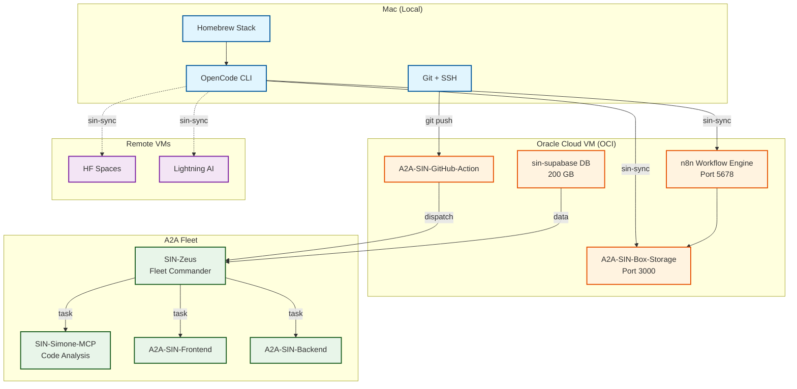

<a name="readme-top"></a>

# Infra-SIN-Dev-Setup

<p align="center">
<a href="https://github.com/OpenSIN-AI/Infra-SIN-Dev-Setup/blob/main/LICENSE">

</a>
<a href="https://github.com/OpenSIN-AI/Infra-SIN-Dev-Setup/stargazers">

</a>
<a href="https://github.com/OpenSIN-AI/Infra-SIN-Dev-Setup/network/members">

</a>
<a href="https://github.com/OpenSIN-AI/Infra-SIN-Dev-Setup/last-commit">

</a>
<a href="https://docs.docker.com/">

</a>
<a href="https://www.oracle.com/cloud/free/">

</a>
</p>

<p align="center">
<a href="#quick-start">Quick Start</a> · <a href="#was-ist-dies">Was ist dies?</a> · <a href="#setup-guide">Setup Guide</a> · <a href="#features">Features</a> · <a href="#system-architecture">Architektur</a> · <a href="#enthaltene-repos">Repositories</a> · <a href="#related">Related</a> · <a href="#troubleshooting">Troubleshooting</a> · <a href="#contributing">Contributing</a>
</p>

<p align="center">
<em>Dein komplettes OpenSIN-AI Development-Environment aufsetzen — von 0 auf produktiv in 30 Minuten.</em>
</p>

---

## Quick Start

<table>
<tr>
<td width="33%" align="center">
<strong>1. OCI VM aufsetzen</strong><br/><br/>
<code>OCI-dev-setup.md</code><br/><br/>

</td>
<td width="33%" align="center">
<strong>2. macOS Dev Environment</strong><br/><br/>
<code>macOS-dev-setup.md</code><br/><br/>

</td>
<td width="33%" align="center">
<strong>3. OpenCode Stack</strong><br/><br/>
<code>upgraded-opencode-stack</code><br/><br/>

</td>
</tr>
</table>

> [!TIP]
> Für eine vollständige OCI VM mit n8n, A2A-SIN-GitHub-Action und Box.com Storage → folge `OCI-dev-setup.md` Schritt für Schritt.

<p align="right">(<a href="#readme-top">back to top</a>)</p>

---

## Was ist dies?

Dieses Repository dokumentiert und automatisiert das komplette OpenSIN-AI Development-Environment Setup. Es führt dich durch:

| Bereich | Beschreibung |
|:---|:---|
| **Oracle Cloud Infrastructure** | Kostenlose A1.Flex VM (4 OCPUs, 24 GB RAM) mit n8n und allen A2A Services |
| **macOS Development Environment** | Homebrew, Git, Node.js, Bun, Python, VS Code — richtig konfiguriert |
| **OpenCode CLI Stack** | Der komplette upgraded-opencode-stack mit allen Skills, Plugins und Agents |

**Kein Manueles Setup mehr** — folge den Anleitungen und dein System ist in 30 Minuten einsatzbereit.

<p align="right">(<a href="#readme-top">back to top</a>)</p>

---

## Setup Guide

### 1. Oracle Cloud Account + VM erstellen → **[OCI-dev-setup.md](./OCI-dev-setup.md)** — Schritt-für-Schritt Anleitung für:
- Oracle Cloud Free Tier Account anlegen
- A1.Flex Always-Free VM erstellen (4 OCPUs, 24 GB RAM)
- SSH Zugang einrichten
- Budget Alerts konfigurieren

> [!IMPORTANT]
> Frankfurt (eu-frankfurt-1) hat 3 Availability Domains — wenn AD1 voll ist, probiere AD2 oder AD3. Alternativ: PAYGO Account erstellen (bleibt innerhalb Always-Free Limits, $300 Credits).

### 2. macOS Development Environment → **[macOS-dev-setup.md](./macOS-dev-setup.md)** — Installation von:
- Homebrew (Paketmanager)
- Git (Versionskontrolle)
- Node.js + Bun (JavaScript Runtime — NICHT npm!)
- Python 3.12+
- VS Code
- SSH Key für GitHub
- Docker Desktop
- iTerm2 (empfohlen)

### 3. OpenCode Stack installieren

```bash
# upgraded-opencode-stack klonen
gh repo clone Delqhi/upgraded-opencode-stack ~/dev/upgraded-opencode-stack
cd ~/dev/upgraded-opencode-stack

# Installation
./install.sh

# Global Brain initialisieren (PFLICHT!)
node ~/.config/opencode/skills/global-brain/src/cli.js setup-hooks \
  --project $(basename "$PWD") \
  --project-root "$PWD" \
  --agents-directive

# Config syncen (nach OCI VM)
sin-sync
```

> [!NOTE]
> Mehr Details im [upgraded-opencode-stack Repository](https://github.com/Delqhi/upgraded-opencode-stack).

<p align="right">(<a href="#readme-top">back to top</a>)</p>

---

## Features

| Capability | Description | Status |
|:---|:---|:---:|
| **Oracle Cloud A1.Flex** | 4 OCPUs, 24 GB RAM, Always-Free | ✅ |
| **n8n Workflow Engine** | Workflow Automation auf OCI VM | ✅ |
| **A2A-SIN-GitHub-Action** | CI/CD-ähnliche Automation (KEINE GitHub Actions!) | ✅ |
| **Box.com Storage** | Unlimited Cloud Storage für Logs/Screenshots | ✅ |
| **OpenCode CLI** | Mit 29+ Skills, 5 Plugins, 21 Agents | ✅ |
| **sin-sync** | Config-Sync Mac → OCI VM → HF VMs | ✅ |
| **Zentrales A2A Team Register** | 17 Teams klassifiziert in oh-my-sin.json | ✅ |
| **Budget Alerts** | OCI Cost Monitoring (Pflicht!) | ✅ |

<details>
<summary>Vollständige Tool-Liste — Alle Komponenten</summary>

### OCI VM Services
- **n8n** (Port 5678) — Workflow Automation
- **A2A-SIN-GitHub-Action** — GitHub Integration
- **A2A-SIN-Box-Storage** (Port 3000) — Cloud Storage
- **sin-supabase** — Datenbank (200 GB Storage)

### OpenCode Stack
- **29+ Custom Skills** — A2A Agent Builder, Deploy, Debug, Browser Automation
- **5 Auth Plugins** — Antigravity OAuth, Qwen OAuth, OpenRouter Proxy
- **11 CLI Tools** — sin-sync, sin-n8n, sin-telegrambot, sin-rotate, sin-health
- **13 Custom Commands** — Swarm orchestration, Terminal orchestration, Zeus bootstrap
- **21 A2A Agents** — Zeus, Simone, Frontend, Backend, Fullstack, etc.
- **Global-Brain (DPMA v4)** — Multi-Project Memory
- **Local-Brain / GraphRAG** — Projekt-basiertes Plan-Gedächtnis
- **oh-my-sin.json** — Zentrales A2A Team Register (17 Teams)
</details>

<p align="right">(<a href="#readme-top">back to top</a>)</p>

---

## System Architecture



> [!IMPORTANT]
> **Wir nutzen KEINE GitHub Actions!** Stattdessen läuft auf unserer OCI VM ein n8n Workflow mit A2A-SIN-GitHub-Action für CI/CD-ähnliche Automation.

<p align="right">(<a href="#readme-top">back to top</a>)</p>

---

## Enthaltene Repos

| Repository | Beschreibung | Link |
|:---|:---|:---|
| **Infra-SIN-Dev-Setup** | Dieses Repo — Setup-Dokumentation | [GitHub](https://github.com/OpenSIN-AI/Infra-SIN-Dev-Setup) |
| **upgraded-opencode-stack** | Kompletter OpenCode CLI Stack — Skills, Plugins, Agents, Commands | [GitHub](https://github.com/Delqhi/upgraded-opencode-stack) |
| **oh-my-sin.json** | Zentrales A2A Team Register — 17 Teams klassifiziert | Im upgraded-opencode-stack |

<details>
<summary>upgraded-opencode-stack — Enthaltene Komponenten</summary>

| Komponente | Anzahl | Details |
|:---|:---:|:---|
| **Skills** | 29+ | create-a2a, create-a2a-team, enterprise-deep-debug, browser-crashtest-lab, etc. |
| **Plugins** | 5 | opencode-antigravity-auth, opencode-qwen-auth, opencode-openrouter-auth, etc. |
| **CLI Tools** | 11 | sin-sync, sin-n8n, sin-telegrambot, sin-rotate, sin-health, etc. |
| **Custom Commands** | 13 | omoc-jam, omoc-max, sin-terminal-orchestrate, sin-zeus-bootstrap, etc. |
| **A2A Agents** | 21 | SIN-Zeus, SIN-Simone-MCP, A2A-SIN-Frontend, Backend, Fullstack, etc. |
| **Provider Configs** | 5 | Google Antigravity, OpenAI, NVIDIA NIM, OpenRouter, Qwen |

**Wichtigste Features:**
- **Global-Brain (DPMA v4)** — Multi-Project Memory
- **Local-Brain / GraphRAG** — Projekt-basiertes Plan-Gedächtnis
- **OMOC Swarm** — 5-Agenten-Schwarm für komplexe Tasks
- **sin-sync** — Identische Configs auf Mac, OCI VM, HF VMs
- **oh-my-sin.json** — Zentrales A2A Team Register (17 Teams)
</details>

<p align="right">(<a href="#readme-top">back to top</a>)</p>

---

## Related

| Repository | Beschreibung |
|:---|:---|
| **[upgraded-opencode-stack](https://github.com/Delqhi/upgraded-opencode-stack)** | Der vollständige OpenCode CLI Stack — clone und installieren für sofortige A2A Agent Productivity |
| **[oh-my-sin.json](https://github.com/Delqhi/upgraded-opencode-stack/blob/main/oh-my-sin.json)** | Zentrales A2A Team Register — 17 Teams (Coding, Worker, Infrastructure, Google Apps, Apple Apps, Social, Messaging, Forum, Legal, Commerce, Community, Research, Media, CyberSec, etc.) |
| **[OpenSIN-AI](https://opensin.ai)** | Das OpenSIN-AI Ökosystem — Enterprise AI Agents die autonom arbeiten |

<p align="right">(<a href="#readme-top">back to top</a>)</p>

---

## Troubleshooting

| Problem | Lösung |
|:---|:---|
| OCI A1.Flex "out of capacity" | Alle 3 ADs in Frankfurt probieren (AD1→AD2→AD3). Alternativ: PAYGO Account erstellen — bleibt kostenlos, nur $100 Hold. |
| macOS: `brew: command not found` | `eval "$(brew shellenv)"` ausführen oder Terminal neu starten |
| GitHub Push verlangt Passwort | SSH Key generieren und in GitHub Settings hinzufügen: `ssh-keygen -t ed25519 -C "email"` |
| n8n startet nicht auf OCI | `sudo systemctl status n8n` prüfen, Logs: `sudo journalctl -u n8n -f` |
| sin-sync schlägt fehl | OCI VM erreichbar? `ping 92.5.60.87`. SSH Key im authorized_keys? |
| Box.com Upload fehlgeschlagen | `BOX_STORAGE_API_KEY` in `.env` gesetzt? Service erreichbar? `curl http://room-09-box-storage:3000/health` |

> [!WARNING]
> Bei OOM-Kill (Process killed) auf macOS: **NIEMALS npm nutzen!** Immer `bun install` — npm frisst 4-6 GB RAM.

<p align="right">(<a href="#readme-top">back to top</a>)</p>

---

## Contributing

1. Fork das Repository
2. Feature Branch erstellen (`git checkout -b feature/amazing-feature`)
3. Änderungen machen
4. Tests durchführen
5. Commit (`git commit -m 'Add amazing feature'`)
6. Push (`git push origin feature/amazing-feature`)
7. Pull Request öffnen

> [!NOTE]
> Für größere Änderungen: Erst Issue erstellen, dann PR.

---

## License

Distributed under the **MIT License**. See [LICENSE](LICENSE) for more information.

---

<p align="center">
<a href="https://opensin.ai">

</a>
</p>
<p align="center">
<sub>Entwickelt vom <a href="https://opensin.ai"><strong>OpenSIN-AI</strong></a> Ökosystem – Enterprise AI Agents die autonom arbeiten.</sub><br/>
<sub>🌐 <a href="https://opensin.ai">opensin.ai</a> · 💬 <a href="https://opensin.ai/agents">Alle Agenten</a> · 🚀 <a href="https://opensin.ai/dashboard">Dashboard</a></sub>
</p>

<p align="right">(<a href="#readme-top">back to top</a>)</p>