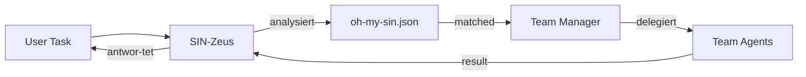
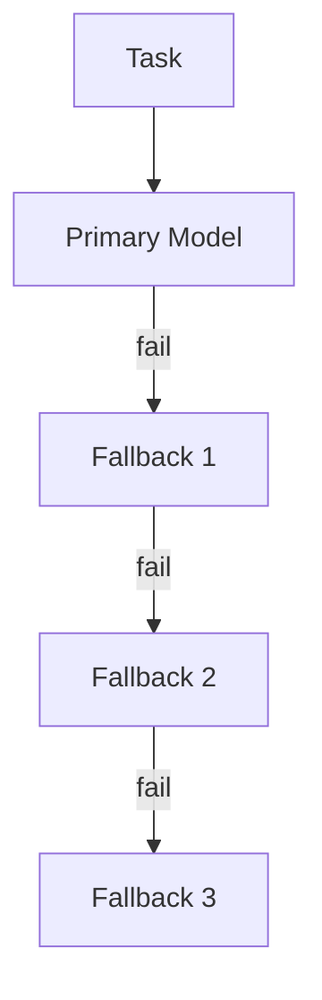

# oh-my-sin.json — Zentrales A2A Team Register

<p align="center">
<a href="https://github.com/Delqhi/upgraded-opencode-stack/blob/main/LICENSE">

</a>
<a href="https://github.com/Delqhi/upgraded-opencode-stack">

</a>
<a href="https://github.com/Delqhi/upgraded-opencode-stack/network/members">

</a>
</p>

<p align="center">
<a href="#overview">Overview</a> · <a href="#teams">Teams</a> · <a href="#structure">Structure</a> · <a href="#usage">Usage</a> · <a href="#models">Models</a>
</p>

<p align="center">
<em>Zentrales Register aller A2A Teams — klassifiziert nach Zweck, Modell und Konfiguration.</em>
</p>

---

## Overview

`oh-my-sin.json` ist das **zentrale Team Register** für das gesamte OpenSIN-AI A2A-Flotten-Ökosystem. Es definiert:

| Aspekt              | Beschreibung                                                             |
| :------------------ | :----------------------------------------------------------------------- |
| **17 Teams**        | Klassifiziert nach Einsatzbereich (Coding, Worker, Infrastructure, etc.) |
| **40+ Agents**      | Mit spezifischen Modellen und Fallback-Ketten                            |
| **Default-Modelle** | Pro Team definierte Primary und Fallback Models                          |
| **Config-Dateien**  | Jedes Team hat seine eigene `my-sin-team-*.json` Konfiguration           |

> [!IMPORTANT]
> Das Team Register wird vom **SIN-Zeus Fleet Commander** verwendet um Tasks automatisch an das richtige Team zu dispatchen.

<p align="right">(<a href="#readme-top">back to top</a>)</p>

---

## Teams

| Team                     | Beschreibung                                                                 | Manager                     | Agents                                                                                                                      |
| :----------------------- | :--------------------------------------------------------------------------- | :-------------------------- | :-------------------------------------------------------------------------------------------------------------------------- |
| **team-code**            | Elite-Coder-Flotte für Implementation, Testing, Deployment                   | A2A-SIN-Zeus                | Simone-MCP, Frontend, Backend, Fullstack                                                                                    |
| **team-worker**          | Autonome Worker für Surveys, Freelancing, Monetarisierung                    | A2A-SIN-Team-Worker         | Prolific, Freelancer, Survey                                                                                                |
| **team-infrastructure**  | DevOps-Flotte für Deployment, CI/CD, Monitoring                              | A2A-SIN-Team-Infrastructure | Deploy, Monitoring, Security                                                                                                |
| **team-google-apps**     | Google Workspace Integration — Docs, Sheets, Drive, Gmail                    | A2A-SIN-Google-Apps         | Google-Docs, Google-Sheets, Google-Drive                                                                                    |
| **team-apple-apps**      | Apple Ecosystem — macOS Automation, iOS, Shortcuts                           | A2A-SIN-Apple-Apps          | Apple-Shortcuts, Apple-macOS                                                                                                |
| **team-apple**           | macOS/iOS Automation — Mail, Notes, Calendar, FaceTime, Safari               | A2A-SIN-Apple               | Mail, Notes, Calendar, Reminders, Photos, FaceTime, Notifications, Mobile, Safari, DeviceControl, Shortcuts, SystemSettings |
| **team-social**          | Social Media Automation — TikTok, Instagram, X, LinkedIn, Facebook, YouTube  | A2A-SIN-Social              | Instagram, Medium, YouTube, TikTok, X-Twitter                                                                               |
| **team-messaging**       | Messaging Integration — WhatsApp, Telegram, Signal, Discord, iMessage        | A2A-SIN-Messaging           | WhatsApp, Teams, WeChat, LINE, Nostr, Zoom                                                                                  |
| **team-forum**           | Forum Automation — Reddit, HackerNews, StackOverflow, Quora, DevTo           | A2A-SIN-Forum               | StackOverflow, Quora                                                                                                        |
| **team-legal**           | Legal Automation — ClaimWriter, Patents, Damages, Compliance, Contract       | A2A-SIN-Legal               | Patents, Tax                                                                                                                |
| **team-commerce**        | Commerce Automation — Shop-Finance, Shop-Logistic, TikTok-Shop, Stripe       | A2A-SIN-Commerce            | TikTok-Shop                                                                                                                 |
| **team-community**       | Community Management — Discord, WhatsApp, Telegram, YouTube Community        | A2A-SIN-Community           | —                                                                                                                           |
| **team-google**          | Google Workspace — Google-Apps, Google-Chat, Opal                            | A2A-SIN-Google              | Opal                                                                                                                        |
| **team-microsoft**       | Microsoft 365 — Teams, Outlook, OneDrive, Excel, Word, PowerPoint            | A2A-SIN-Microsoft           | —                                                                                                                           |
| **team-research**        | Deep Research Agent                                                          | A2A-SIN-Research            | Research                                                                                                                    |
| **team-media-comfyui**   | Media Generation — ImageGen, VideoGen, ComfyUI Workflows                     | A2A-SIN-Media-ComfyUI       | —                                                                                                                           |
| **team-media-music**     | Music Production — Beats, Producer, Singer, Songwriter, Videogen             | A2A-SIN-Media-Music         | —                                                                                                                           |
| **team-coding-cybersec** | Security Specialists — BugBounty, Cloudflare, 16x Security-Spezialisten      | A2A-SIN-Code-CyberSec       | Security-Recon, Security-Fuzz                                                                                               |
| **team-coding-frontend** | Frontend Specialists — Accessibility, App-Shell, Commerce-UI, Design-Systems | A2A-SIN-Code-Frontend       | —                                                                                                                           |
| **team-coding-backend**  | Backend Specialists — Server, OracleCloud, Passwordmanager                   | A2A-SIN-Code-Backend        | —                                                                                                                           |

> [!NOTE]
> Einige Teams haben noch keine aktiven Agents ("—"). Diese werden bei Bedarf durch den A2A Agent Builder erstellt.

<p align="right">(<a href="#readme-top">back to top</a>)</p>

---

## Structure

### Hauptstruktur

```json
{
  "teams": {
    "team-code": {
      "name": "Team Coding",
      "description": "Elite-Coder-Flotte...",
      "manager": "A2A-SIN-Zeus",
      "config_file": "my-sin-team-code.json",
      "members": ["A2A-SIN-Simone-MCP", "A2A-SIN-Frontend", ...],
      "primary_model": "google/antigravity-claude-sonnet-4-6",
      "fallback_models": ["openai/gpt-5.4", "qwen/coder-model", ...]
    },
    ...
  },
  "defaults": {
    "explore_model": "nvidia-nim/stepfun-ai/step-3.5-flash",
    "librarian_model": "nvidia-nim/stepfun-ai/step-3.5-flash",
    "fallback_models": [...]
  }
}
```

### Team-Config-Dateien

Jedes Team hat eine eigene Config-Datei (`my-sin-team-*.json`):

| Team                | Config-Datei                      | Primary Model                 |
| :------------------ | :-------------------------------- | :---------------------------- |
| team-code           | `my-sin-team-code.json`           | antigravity-claude-sonnet-4-6 |
| team-worker         | `my-sin-team-worker.json`         | antigravity-gemini-3-flash    |
| team-infrastructure | `my-sin-team-infrastructure.json` | gpt-5.4                       |
| team-google-apps    | `my-sin-team-google-apps.json`    | antigravity-gemini-3.1-pro    |
| team-apple          | `my-sin-apple.json`               | gpt-5.4                       |
| team-social         | `my-sin-social.json`              | antigravity-gemini-3.1-pro    |
| team-messaging      | `my-sin-messaging.json`           | antigravity-gemini-3-flash    |
| ...                 | ...                               | ...                           |

<p align="right">(<a href="#readme-top">back to top</a>)</p>

---

## Usage

### Wie Zeus Tasks dispatcht



### Task-Routing nach Team

| Task-Typ                    | Ziel-Team            | Beispiel                         |
| :-------------------------- | :------------------- | :------------------------------- |
| Code schreiben / refactoren | team-code            | "baue mir ein React Dashboard"   |
| Surveys ausfüllen           | team-worker          | "verdiene $500 auf Prolific"     |
| Google Docs erstellen       | team-google-apps     | "schreibe einen Patent-Anspruch" |
| macOS automatisieren        | team-apple           | "Sende eine iMessage"            |
| Auf Social Media posten     | team-social          | "poste auf Twitter"              |
| WhatsApp Nachrichten        | team-messaging       | "sende eine WhatsApp"            |
| OCI VM aufsetzen            | team-infrastructure  | "deploye auf OCI"                |
| Bugs finden                 | team-coding-cybersec | "finde SQL Injections"           |

<p align="right">(<a href="#readme-top">back to top</a>)</p>

---

## Models

### Model Priority Chain

Für jede Task-Kategorie ist eine Failover-Kette definiert:



### Model Overview

| Provider                                 | Modelle                                                                     | Einsatz                              |
| :--------------------------------------- | :-------------------------------------------------------------------------- | :----------------------------------- |
| **google/antigravity-\***                | Claude Sonnet 4.6, Claude Opus 4.6 Thinking, Gemini 3.1 Pro, Gemini 3 Flash | Primary für die meisten Teams        |
| **openai/gpt-5.4**                       | GPT-5.4                                                                     | Backend, Infrastructure, Apple Teams |
| **qwen/coder-model**                     | Qwen 3.6 Plus                                                               | Fallback für Coding Tasks            |
| **nvidia-nim/stepfun-ai/step-3.5-flash** | Step 3.5 Flash                                                              | Explore/Librarian Subagents          |
| **modal/glm-5.1-fp8**                    | GLM 5.1 FP8                                                                 | Spezialaufgaben via OCI Token Pool   |

### Team-spezifische Models

| Team                    | Primary Model                 | Fallback Chain                                                                |
| :---------------------- | :---------------------------- | ----------------------------------------------------------------------------- |
| **team-code**           | antigravity-claude-sonnet-4-6 | gpt-5.4 → qwen/coder-model → antigravity-gemini-3.1-pro                       |
| **team-worker**         | antigravity-gemini-3-flash    | gpt-5.4 → qwen/coder-model → step-3.5-flash                                   |
| **team-infrastructure** | gpt-5.4                       | antigravity-claude-sonnet-4-6 → qwen/coder-model → antigravity-gemini-3.1-pro |
| **team-google-apps**    | antigravity-gemini-3.1-pro    | gpt-5.4 → qwen/coder-model → antigravity-claude-sonnet-4-6                    |
| **team-research**       | antigravity-gemini-3.1-pro    | gpt-5.4 → antigravity-claude-opus-4-6-thinking                                |

<p align="right">(<a href="#readme-top">back to top</a>)</p>

---

## Datei Location

Die originale `oh-my-sin.json` befindet sich im **upgraded-opencode-stack** Repository:

```
upgraded-opencode-stack/
├── oh-my-sin.json              # Zentrales Team Register
├── my-sin-team-code.json       # Team Coding Config
├── my-sin-team-worker.json     # Team Worker Config
├── my-sin-team-infrastructure.json
├── my-sin-apple.json
├── my-sin-google.json
├── my-sin-social.json
├── my-sin-messaging.json
└── ... (mehr Team Configs)
```

**Link:** [github.com/Delqhi/upgraded-opencode-stack/blob/main/oh-my-sin.json](https://github.com/Delqhi/upgraded-opencode-stack/blob/main/oh-my-sin.json)

---

<p align="center">
<a href="https://opensin.ai">

</a>
</p>
<p align="center">
<sub>Entwickelt vom <a href="https://opensin.ai"><strong>OpenSIN-AI</strong></a> Ökosystem – Enterprise AI Agents die autonom arbeiten.</sub><br/>
<sub>🌐 <a href="https://opensin.ai">opensin.ai</a> · 💬 <a href="https://opensin.ai/agents">Alle Agenten</a> · 🚀 <a href="https://opensin.ai/dashboard">Dashboard</a></sub>
</p>

<p align="right">(<a href="#readme-top">back to top</a>)</p>
